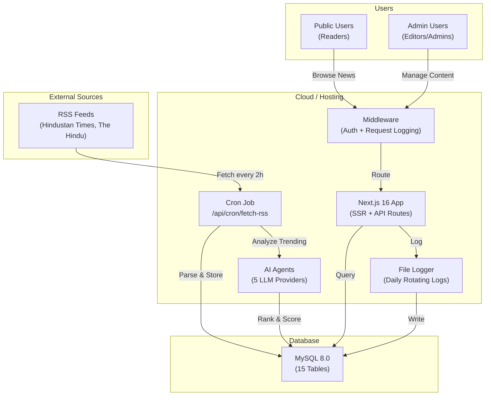
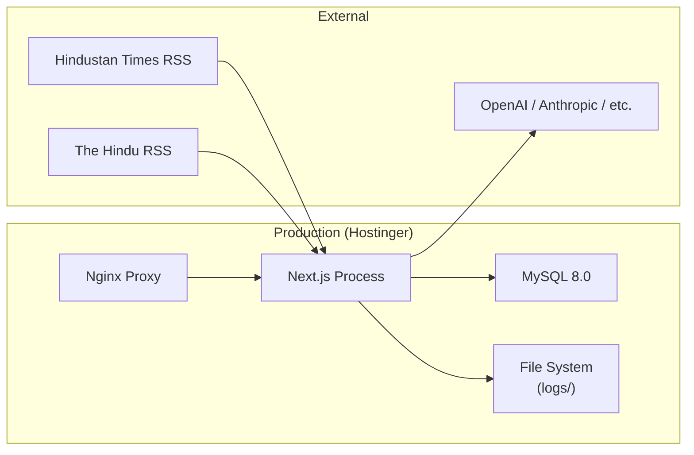

# System Design — Belgaum Today

## 1. Overview

**Belgaum Today** is an AI-powered, multi-category news aggregation platform for the Belgaum (Belagavi) region and India. It automatically fetches, processes, and serves real-time news from RSS feeds, uses AI agents to rank trending articles, and provides a full admin panel for content and system management.

**Live Domain:** `belgaum.today`

---

## 2. Architecture Diagram



---

## 3. System Layers

### Layer 1 — Data Ingestion (Cron)

| Component | Description |
|---|---|
| `/api/cron/fetch-rss` | Scheduled background job — fetches all active RSS feeds, parses XML, deduplicates articles, stores in MySQL |
| `src/lib/rss.ts` | RSS XML parser — handles CDATA, media:content, image extraction, source detection |
| `rss_feed_config` table | 34 configured feeds across 6 categories (India, Business, Technology, Sports, Entertainment, Belgaum) |

### Layer 2 — AI Analysis

| Component | Description |
|---|---|
| `src/lib/ai/agents.ts` | Multi-agent system — unified interface for 5 LLM providers (OpenAI, Anthropic, DeepSeek, Gemini, SarvamAI) |
| `src/lib/ai/prompts.ts` | System + user prompt builder for trending article analysis |
| `src/lib/ai/crypto.ts` | AES-256-GCM encryption for API keys stored in DB |
| `trending_articles` table | AI-ranked articles with scores, reasoning, and batch IDs |

### Layer 3 — API Layer (20 Routes)

| Group | Routes | Purpose |
|---|---|---|
| **Public** | `/api/articles`, `/api/articles/[id]`, `/api/articles/slug/[slug]`, `/api/articles/featured`, `/api/search`, `/api/trending-topics` | Article browsing, search, trending topics |
| **Auth** | `/api/auth/login`, `/api/auth/logout` | JWT-based admin authentication |
| **Admin** | `/api/admin/stats`, `/api/admin/articles`, `/api/admin/feeds`, `/api/admin/logs`, `/api/admin/agent-logs`, `/api/admin/providers`, `/api/admin/models`, `/api/admin/api-keys`, `/api/admin/cron` | Dashboard, content management, AI configuration |
| **Tracking** | `/api/track/view`, `/api/track/source` | Analytics — article views, source clicks |
| **Cron** | `/api/cron/fetch-rss` | Background RSS fetch + AI trending |

### Layer 4 — Frontend (Next.js 16 SSR)

| Page Type | Pages |
|---|---|
| **Public** | Home (`/`), Category (`/india`, `/business`, `/technology`, `/sports`, `/entertainment`), Article (`/article/[slug]`), Search (`/search`) |
| **Admin** | Login (`/admin/login`), Dashboard (`/admin/dashboard`), Articles (`/admin/articles`), Feeds (`/admin/feeds`), Agents (`/admin/agents`), Agent Logs (`/admin/agents-log`), API Keys (`/admin/api-keys`), System Logs (`/admin/logs`) |
| **SEO** | `robots.ts`, `sitemap.ts`, `feed.xml` |

### Layer 5 — Infrastructure

| Component | Description |
|---|---|
| MySQL 8.0 | 15 tables — articles, users, tags, feeds, AI config, logs, analytics |
| Docker Compose | Local dev DB on port 3307, auto-initializes from `schema.sql` |
| File Logger | Daily rotating JSON log files — 5 channels (app, api, cron, ai, error) |
| Middleware | Auth guard for admin routes + request logging |

---

## 4. Data Flow

### 4.1 News Ingestion Flow

```
Cron Trigger → Fetch RSS Configs from DB → Fetch XML from each feed →
Parse items → Deduplicate (source_url + title) → Store articles in DB →
Per-category: fetch recent articles → Send to AI Agent → Rank trending →
Store in trending_articles table → Done
```

### 4.2 Public User Flow

```
User visits page → Middleware logs request → SSR fetches articles from DB →
Render page with Header/Sidebar/Footer → User clicks article →
Track view (POST /api/track/view) → Redirect to source (POST /api/track/source)
```

### 4.3 Admin Flow

```
Admin visits /admin/login → Middleware checks auth cookie →
JWT token + httpOnly cookie set on successful login →
All /admin/* routes protected by middleware → Admin CRUD via /api/admin/* →
Actions logged to system_logs + file logger
```

---

## 5. Technology Stack

| Layer | Technology | Version |
|---|---|---|
| **Framework** | Next.js (App Router, RSC, SSR) | 16.1.6 |
| **Language** | TypeScript | 5.x |
| **Runtime** | React (Server + Client Components) | 19.2.3 |
| **Styling** | Tailwind CSS | 4.x |
| **Database** | MySQL | 8.0 |
| **ORM** | Raw SQL via `mysql2/promise` | 3.16.3 |
| **Auth** | JWT + bcryptjs + httpOnly cookies | jwt 9.x, bcryptjs 3.x |
| **AI** | OpenAI SDK (multi-provider) | 6.22.0 |
| **Icons** | Lucide React | 0.563.0 |
| **Charts** | Recharts | 3.7.0 |
| **RSS** | Custom XML parser (zero-dependency) | — |
| **Containerization** | Docker Compose | 3.8 |
| **Logging** | Custom file logger (JSON-lines, daily rolling) | — |

---

## 6. Security Architecture

| Concern | Implementation |
|---|---|
| **Authentication** | JWT tokens (24h expiry) stored in httpOnly secure cookies |
| **Password Storage** | bcryptjs with 12 salt rounds |
| **API Key Storage** | AES-256-GCM encryption (using JWT_SECRET as passphrase) |
| **Route Protection** | Middleware checks JWT on all `/admin/*` and `/api/admin/*` routes |
| **RBAC** | 3 roles: admin > editor > viewer (hierarchical) |
| **Cron Auth** | Secret-based (`CRON_SECRET` query parameter) |
| **XSS Prevention** | React's built-in escaping + server-side rendering |
| **SQL Injection** | Parameterized queries only (via `mysql2` prepared statements) |

---

## 7. Deployment Architecture



### Local Development

```
Docker Compose (MySQL 8.0 on port 3307)
    → npm run dev (Next.js on port 3000)
    → Logs written to logs/ directory
```
