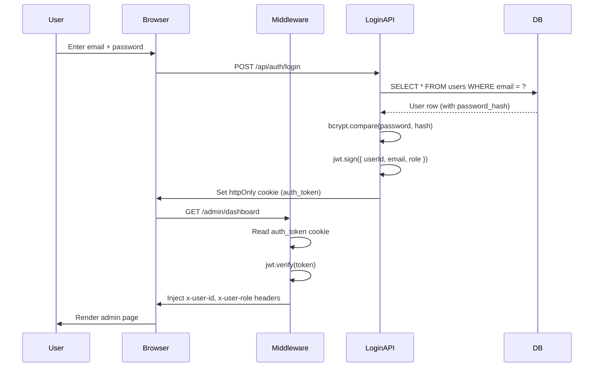
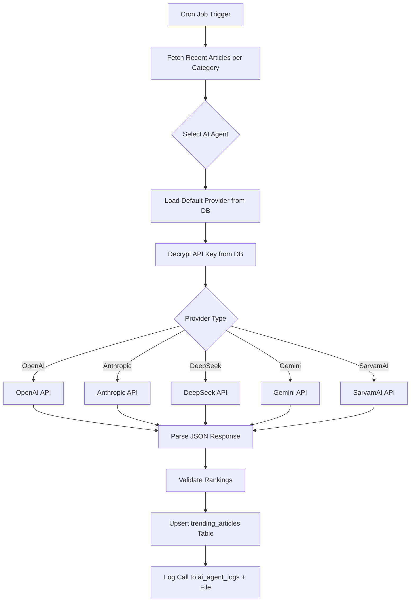
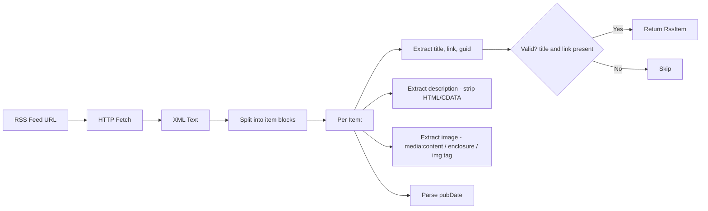

# Technical Document — Belgaum Today

## 1. Technology Stack

| Category | Technology | Version | Purpose |
|---|---|---|---|
| **Framework** | Next.js (App Router) | 16.1.6 | Full-stack React framework with SSR, API routes, middleware |
| **Language** | TypeScript | 5.x | Type-safe development |
| **UI Library** | React | 19.2.3 | Server + Client Components, React Compiler enabled |
| **Styling** | Tailwind CSS | 4.x | Utility-first CSS with PostCSS |
| **Database** | MySQL | 8.0 | Relational database with full-text search |
| **DB Driver** | mysql2/promise | 3.16.3 | Connection pooling, prepared statements |
| **Auth** | jsonwebtoken + bcryptjs | 9.x / 3.x | JWT tokens + password hashing |
| **AI SDK** | OpenAI SDK | 6.22.0 | Unified interface for all LLM providers |
| **Icons** | Lucide React | 0.563.0 | SVG icon library |
| **Charts** | Recharts | 3.7.0 | Dashboard analytics charts |
| **Date** | date-fns | 4.1.0 | Date formatting and manipulation |
| **Markdown** | react-markdown + remark-gfm | 10.1.0 / 4.0.1 | Article content rendering |
| **Slug** | slugify | 1.6.6 | URL-safe slug generation |
| **CSS Utils** | clsx | 2.1.1 | Conditional class name merging |
| **Container** | Docker Compose | 3.8 | Local MySQL database |

---

## 2. Project Structure

```
belgaum.today/
├── database/
│   └── schema.sql              # Full DB schema + seed data (15 tables)
├── docs/                       # Project documentation
├── logs/                       # Daily rotating log files (JSON-lines)
├── scripts/                    # Utility scripts
├── src/
│   ├── app/
│   │   ├── [category]/         # Dynamic category pages
│   │   ├── admin/              # Admin panel (8 pages + layout)
│   │   │   ├── agents/         # AI provider management
│   │   │   ├── agents-log/     # AI call history
│   │   │   ├── api-keys/       # API key management (encrypted)
│   │   │   ├── articles/       # Article CRUD + edit page
│   │   │   ├── dashboard/      # Analytics dashboard
│   │   │   ├── feeds/          # RSS feed management
│   │   │   ├── login/          # Admin login
│   │   │   ├── logs/           # System logs viewer
│   │   │   └── layout.tsx      # Admin shell (sidebar + header)
│   │   ├── api/
│   │   │   ├── admin/          # 9 admin API routes
│   │   │   ├── articles/       # 4 article API routes
│   │   │   ├── auth/           # login + logout
│   │   │   ├── cron/           # RSS fetch cron job
│   │   │   ├── search/         # Full-text search
│   │   │   ├── track/          # View + source tracking
│   │   │   └── trending-topics/# AI-ranked trending
│   │   ├── article/[slug]/     # Article detail page
│   │   ├── business/           # Dedicated category page
│   │   ├── entertainment/      # Dedicated category page
│   │   ├── india/              # Dedicated category page
│   │   ├── search/             # Search page
│   │   ├── sports/             # Dedicated category page
│   │   ├── technology/         # Dedicated category page
│   │   ├── feed.xml/           # RSS feed output
│   │   ├── globals.css         # Global styles + Tailwind base
│   │   ├── layout.tsx          # Root layout (HTML head, body)
│   │   ├── page.tsx            # Homepage
│   │   ├── robots.ts           # SEO robots.txt
│   │   └── sitemap.ts          # Dynamic sitemap
│   ├── components/
│   │   ├── articles/           # ArticleCard, ArticleGrid, FeaturedArticle, ShareButtons, NewsFallbackImage
│   │   ├── layout/             # Header, Footer, Sidebar
│   │   └── ui/                 # Badge, Button, Card, Input, Toast, Tooltip
│   ├── lib/
│   │   ├── ai/
│   │   │   ├── agents.ts       # Multi-provider AI agent system
│   │   │   ├── prompts.ts      # Trending analysis prompts
│   │   │   └── crypto.ts       # AES-256-GCM key encryption
│   │   ├── auth.ts             # JWT + bcrypt + cookie management
│   │   ├── db.ts               # MySQL connection pool + query helpers
│   │   ├── fileLogger.ts       # Daily rotating JSON file logger
│   │   ├── logger.ts           # DB + file logger (dual write)
│   │   ├── openai.ts           # AI module re-export
│   │   ├── rss.ts              # RSS XML parser
│   │   ├── utils.ts            # Utility functions
│   │   └── withLogging.ts      # API route logging wrapper
│   ├── middleware.ts            # Auth guard + request logging
│   └── types/
│       └── index.ts            # All TypeScript interfaces + types
├── docker-compose.yml          # MySQL 8.0 container
├── next.config.ts              # Next.js config (images, compiler)
├── package.json                # Dependencies + scripts
├── tsconfig.json               # TypeScript config
└── .env.local                  # Environment variables
```

---

## 3. Database Connection

```typescript
// src/lib/db.ts — Connection pool using mysql2/promise
const pool = mysql.createPool({
    host: process.env.DATABASE_HOST || '127.0.0.1',
    port: parseInt(process.env.DATABASE_PORT || '3306'),
    user: process.env.DATABASE_USER || 'belgaum_user',
    password: process.env.DATABASE_PASSWORD || 'belgaum_pass',
    database: process.env.DATABASE_NAME || 'belgaum_today',
    waitForConnections: true,
    connectionLimit: 10,
    queueLimit: 0,
    enableKeepAlive: true,
    keepAliveInitialDelay: 0,
});
```

**Helpers provided:**

- `query<T>(sql, params)` — SELECT queries, returns `T[]`
- `queryOne<T>(sql, params)` — Returns first row or `null`
- `execute(sql, params)` — INSERT/UPDATE/DELETE, returns affected rows
- `insert(sql, params)` — INSERT, returns `insertId`
- `transaction(fn)` — Executes callback in a transaction with auto-commit/rollback
- `checkConnection()` — Health check

---

## 4. Authentication Flow



**JWT Configuration:**

- Algorithm: HS256
- Expiry: 24 hours
- Cookie: `auth_token`, httpOnly, secure (production), sameSite=lax

---

## 5. AI Agent Architecture



**Agent Selection Logic:**

1. Query `ai_providers` for default active provider
2. Query `ai_models` for default active model under that provider
3. Query `ai_api_keys` for active key, decrypt with AES-256-GCM
4. Build OpenAI-compatible client (all providers use OpenAI SDK format except Anthropic)
5. Send system prompt + article list → receive JSON rankings
6. Fallback: if primary fails, try next available provider

---

## 6. RSS Parsing Pipeline



**Image extraction priority:**

1. `<media:content url="">`
2. `<media:thumbnail url="">`
3. `<enclosure url="" type="image/*">`
4. `` inside `<description>`

---

## 7. Logging Architecture

```
Request → Middleware → Console Log → [REQ] prefix
         ↓
    API Route Handler
         ↓
    withLogging HOC
         ↓
    fileLogger.apiRequest() / apiResponse()
         ↓
    ┌────────────────────────────────────────────────────────┐
    │  JSON-lines written to File System (logs/):            │
    │  • logs/api-YYYY-MM-DD.log                             │
    │  • logs/cron-YYYY-MM-DD.log                            │
    │  • logs/ai-YYYY-MM-DD.log (also writes to DB table)    │
    │  • logs/error-YYYY-MM-DD.log (if 5xx)                  │
    │  • Console (colored output)                            │
    └────────────────────────────────────────────────────────┘

    *Note: General system logs are NOT written to `system_logs` table to save space.
    Only `ai_agent_logs` are persisted to DB for history.*
```

**Log levels:**

| Environment | Minimum Level | debug | info | warn | error |
|---|---|---|---|---|---|
| Development | `debug` | ✅ | ✅ | ✅ | ✅ |
| Production | `info` | ❌ | ✅ | ✅ | ✅ |

**Log entry format (JSON-lines):**

```json
{
    "timestamp": "2026-02-15T05:01:23.456Z",
    "level": "info",
    "channel": "api",
    "message": "→ GET /api/articles",
    "data": { "query": { "category": "india" }, "ip": "127.0.0.1" }
}
```

---

## 8. Image Handling

**Remote image domains configured in `next.config.ts`:**

- `www.hindustantimes.com` (paths: `/ht-img/**`, `/images/**`)
- `th-i.thgim.com` (paths: `/**`)

**Fallback:** When images fail to load, `NewsFallbackImage` component renders a category-aware SVG placeholder.

---

## 9. SEO Implementation

| Feature | Implementation |
|---|---|
| Server-Side Rendering | All public pages are SSR (Next.js App Router) |
| Meta Tags | Dynamic `<title>`, `<meta description>` per page |
| Sitemap | Dynamic `sitemap.ts` — generates entries from published articles |
| Robots.txt | `robots.ts` — allows all crawlers, references sitemap |
| RSS Feed | `feed.xml/route.ts` — generates XML RSS feed of latest articles |
| Open Graph | Dynamic OG metadata for article pages |
| Canonical URLs | Next.js default canonical URL handling |
| Full-text Search | MySQL FULLTEXT index on `title, excerpt, content` |

---

## 10. Build & Development

```bash
# Development
npm run dev          # Next.js dev server (port 3000)

# Production build
npm run build        # Compile + generate static pages
npm run start        # Start production server

# Linting
npm run lint         # ESLint checks

# Database
docker compose up -d # Start MySQL container
```

**React Compiler:** Enabled via `reactCompiler: true` in `next.config.ts` with `babel-plugin-react-compiler`.
