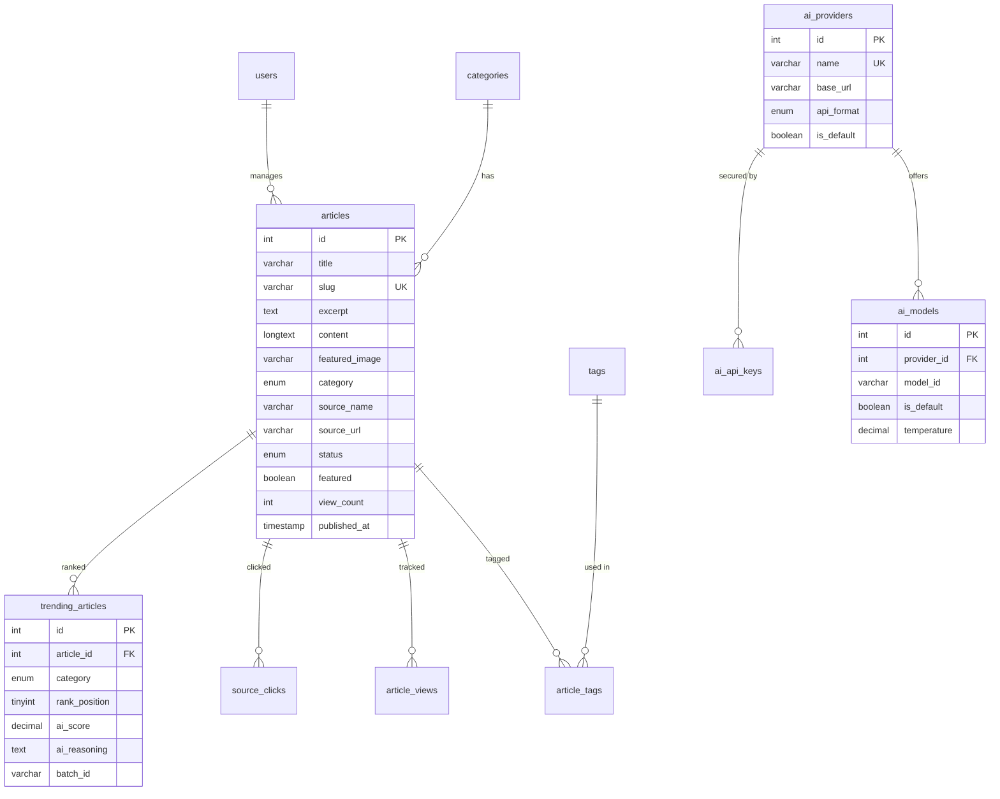

# Database Design — Belgaum Today

## 1. Overview

- **Engine:** MySQL 8.0
- **Schema file:** `database/schema.sql`
- **Total tables:** 15
- **Connection:** `mysql2/promise` connection pool (10 connections, keep-alive enabled)
- **Containerized:** Docker Compose on port 3307 (local), standard 3306 (production)

---

## 2. Entity Relationship Diagram



---

## 3. Table Details

### 3.1 `categories`

**Purpose:** Reference table for news categories.

| Column | Type | Constraints | Description |
|---|---|---|---|
| `id` | INT | PK, AUTO_INCREMENT | Unique ID |
| `name` | VARCHAR(50) | NOT NULL, UNIQUE | Display name (e.g., "India") |
| `slug` | VARCHAR(50) | NOT NULL, UNIQUE | URL slug (e.g., "india") |
| `description` | TEXT | — | Category description |
| `color` | VARCHAR(7) | DEFAULT '#6B7280' | Hex color for badges/UI |
| `created_at` | TIMESTAMP | DEFAULT CURRENT_TIMESTAMP | — |

**Seed data:** India (#FF9933), Business (#4CAF50), Technology (#2196F3), Entertainment (#E91E63), Sports (#FF5722), Belgaum (#9C27B0)

---

### 3.2 `users`

**Purpose:** Admin/editor accounts for the admin panel.

| Column | Type | Constraints | Description |
|---|---|---|---|
| `id` | INT | PK, AUTO_INCREMENT | Unique ID |
| `email` | VARCHAR(255) | NOT NULL, UNIQUE | Login email |
| `password_hash` | VARCHAR(255) | NOT NULL | bcrypt hash (12 rounds) |
| `name` | VARCHAR(100) | NOT NULL | Display name |
| `role` | ENUM('admin','editor','viewer') | DEFAULT 'viewer' | Access level |
| `created_at` | TIMESTAMP | DEFAULT CURRENT_TIMESTAMP | — |
| `updated_at` | TIMESTAMP | ON UPDATE CURRENT_TIMESTAMP | — |

**Indexes:** `idx_email`, `idx_role`
**Default admin:** <admin@belgaum.today> (password: admin123)

---

### 3.3 `articles`

**Purpose:** Core content table — stores all aggregated and manually created news articles.

| Column | Type | Constraints | Description |
|---|---|---|---|
| `id` | INT | PK, AUTO_INCREMENT | Unique ID |
| `title` | VARCHAR(255) | NOT NULL | Article headline |
| `slug` | VARCHAR(300) | NOT NULL, UNIQUE | URL-safe slug |
| `excerpt` | TEXT | — | Short summary (≤500 chars) |
| `content` | LONGTEXT | NOT NULL | Full article body |
| `featured_image` | VARCHAR(500) | — | Image URL from source |
| `category` | ENUM(6 values) | NOT NULL | india/business/tech/entertainment/sports/belgaum |
| `source_name` | VARCHAR(100) | NOT NULL | e.g., "Hindustan Times" |
| `source_url` | VARCHAR(500) | NOT NULL | Original article URL |
| `status` | ENUM('draft','published','archived') | DEFAULT 'draft' | Publication state |
| `featured` | BOOLEAN | DEFAULT FALSE | Homepage hero flag |
| `ai_generated` | BOOLEAN | DEFAULT FALSE | AI-created content flag |
| `ai_confidence` | DECIMAL(3,2) | — | AI confidence score (0.00–1.00) |
| `requires_review` | BOOLEAN | DEFAULT FALSE | Editorial review needed |
| `view_count` | INT | DEFAULT 0 | Aggregated view count |
| `reading_time` | INT | DEFAULT 1 | Estimated minutes to read |
| `published_at` | TIMESTAMP | NULL | When published (NULL if draft) |
| `created_at` | TIMESTAMP | DEFAULT CURRENT_TIMESTAMP | — |
| `updated_at` | TIMESTAMP | ON UPDATE CURRENT_TIMESTAMP | — |

**Indexes:**

- `idx_status` — filter by publication state
- `idx_category` — filter by category
- `idx_featured` — featured article queries
- `idx_published_at` — sort by date
- `idx_slug` — lookup by slug
- `idx_source_url` — deduplication check
- `idx_fulltext (title, excerpt, content)` — FULLTEXT for search

---

### 3.4 `tags` & `article_tags`

**Purpose:** Tagging system for articles (many-to-many).

**tags:**

| Column | Type | Constraints |
|---|---|---|
| `id` | INT | PK, AUTO_INCREMENT |
| `name` | VARCHAR(50) | NOT NULL, UNIQUE |
| `slug` | VARCHAR(50) | NOT NULL, UNIQUE |

**article_tags:**

| Column | Type | Constraints |
|---|---|---|
| `article_id` | INT | PK (composite), FK → articles |
| `tag_id` | INT | PK (composite), FK → tags |

Both FKs have `ON DELETE CASCADE`.

---

### 3.5 `article_views`

**Purpose:** Per-view analytics tracking.

| Column | Type | Constraints | Description |
|---|---|---|---|
| `id` | INT | PK, AUTO_INCREMENT | — |
| `article_id` | INT | NOT NULL, FK → articles | Which article |
| `user_agent` | TEXT | — | Browser user agent |
| `referrer` | VARCHAR(500) | — | HTTP referrer |
| `ip_address` | VARCHAR(45) | — | Client IP (IPv4/IPv6) |
| `created_at` | TIMESTAMP | DEFAULT CURRENT_TIMESTAMP | View timestamp |

**Indexes:** `idx_article_id`, `idx_created_at`

---

### 3.6 `source_clicks`

**Purpose:** Track when users click through to original news sources.

| Column | Type | Constraints | Description |
|---|---|---|---|
| `id` | INT | PK, AUTO_INCREMENT | — |
| `source_name` | VARCHAR(100) | NOT NULL | e.g., "Hindustan Times" |
| `article_id` | INT | FK → articles (SET NULL) | Which article |
| `created_at` | TIMESTAMP | DEFAULT CURRENT_TIMESTAMP | — |

**Indexes:** `idx_source_name`, `idx_created_at`

---

### 3.7 `newsletter_subscriptions`

**Purpose:** Email newsletter signup (future feature).

| Column | Type | Constraints |
|---|---|---|
| `id` | INT | PK, AUTO_INCREMENT |
| `email` | VARCHAR(255) | NOT NULL, UNIQUE |
| `subscribed_at` | TIMESTAMP | DEFAULT CURRENT_TIMESTAMP |
| `unsubscribed_at` | TIMESTAMP | NULL |

---

### 3.8 `rss_feed_config`

**Purpose:** Configuration for RSS feed sources. Managed from admin panel.

| Column | Type | Constraints | Description |
|---|---|---|---|
| `id` | INT | PK, AUTO_INCREMENT | — |
| `name` | VARCHAR(100) | NOT NULL | Feed display name |
| `feed_url` | VARCHAR(500) | NOT NULL, UNIQUE | RSS feed URL |
| `category` | ENUM(6 values) | NOT NULL | Which category to assign articles |
| `fetch_interval_minutes` | INT | DEFAULT 120 | Fetch frequency |
| `is_active` | BOOLEAN | DEFAULT TRUE | Enable/disable |
| `last_fetched_at` | TIMESTAMP | NULL | Last successful fetch |
| `created_at` | TIMESTAMP | DEFAULT CURRENT_TIMESTAMP | — |

**Seed data:** 34 feeds across 5 categories (see Requirements doc).

---

### 3.9 `trending_articles`

**Purpose:** AI-ranked trending articles per category.

| Column | Type | Constraints | Description |
|---|---|---|---|
| `id` | INT | PK, AUTO_INCREMENT | — |
| `article_id` | INT | NOT NULL, FK → articles | Ranked article |
| `category` | ENUM(6 values) | NOT NULL | Category |
| `rank_position` | TINYINT | NOT NULL | 1 = most trending |
| `ai_score` | DECIMAL(5,2) | — | AI confidence (0–100) |
| `ai_reasoning` | TEXT | — | One-sentence AI reasoning |
| `batch_id` | VARCHAR(50) | NOT NULL | Groups results from one AI call |
| `created_at` | TIMESTAMP | DEFAULT CURRENT_TIMESTAMP | — |
| `expires_at` | TIMESTAMP | NULL | When ranking expires |

**Indexes:** `idx_category`, `idx_batch`, `idx_expires`
**Unique key:** `uk_cat_rank (category, rank_position)` — ensures one article per rank per category

---

### 3.10 `ai_providers`

**Purpose:** AI/LLM provider registry.

| Column | Type | Constraints | Description |
|---|---|---|---|
| `id` | INT | PK, AUTO_INCREMENT | — |
| `name` | VARCHAR(50) | NOT NULL, UNIQUE | Identifier (e.g., "openai") |
| `display_name` | VARCHAR(100) | NOT NULL | UI name (e.g., "OpenAI") |
| `base_url` | VARCHAR(500) | — | API base URL |
| `api_format` | ENUM('openai','anthropic','gemini','custom') | DEFAULT 'openai' | SDK compatibility |
| `is_active` | BOOLEAN | DEFAULT TRUE | Provider enabled |
| `is_default` | BOOLEAN | DEFAULT FALSE | Used when no specific selection |
| `created_at` | TIMESTAMP | DEFAULT CURRENT_TIMESTAMP | — |
| `updated_at` | TIMESTAMP | ON UPDATE CURRENT_TIMESTAMP | — |

**Seed data:** OpenAI (default), Anthropic, DeepSeek, Google Gemini, SarvamAI

---

### 3.11 `ai_models`

**Purpose:** Specific LLM models per provider.

| Column | Type | Constraints | Description |
|---|---|---|---|
| `id` | INT | PK, AUTO_INCREMENT | — |
| `provider_id` | INT | NOT NULL, FK → ai_providers | Parent provider |
| `model_id` | VARCHAR(100) | NOT NULL | API model name |
| `display_name` | VARCHAR(100) | NOT NULL | UI display name |
| `is_active` | BOOLEAN | DEFAULT TRUE | Model enabled |
| `is_default` | BOOLEAN | DEFAULT FALSE | Default for this provider |
| `max_tokens` | INT | DEFAULT 1000 | Max response tokens |
| `temperature` | DECIMAL(3,2) | DEFAULT 0.30 | Creativity setting |
| `created_at` | TIMESTAMP | DEFAULT CURRENT_TIMESTAMP | — |
| `updated_at` | TIMESTAMP | ON UPDATE CURRENT_TIMESTAMP | — |

**Unique key:** `uk_provider_model (provider_id, model_id)`
**Seed data:** 9 models across 5 providers

---

### 3.12 `ai_api_keys`

**Purpose:** Encrypted API keys for AI providers.

| Column | Type | Constraints | Description |
|---|---|---|---|
| `id` | INT | PK, AUTO_INCREMENT | — |
| `provider_id` | INT | NOT NULL, FK → ai_providers | Provider this key is for |
| `key_name` | VARCHAR(100) | NOT NULL | Label (e.g., "Production Key") |
| `api_key_encrypted` | TEXT | NOT NULL | AES-256-GCM encrypted key |
| `is_active` | BOOLEAN | DEFAULT TRUE | Key enabled |
| `last_used_at` | TIMESTAMP | NULL | Last API call using this key |
| `created_at` | TIMESTAMP | DEFAULT CURRENT_TIMESTAMP | — |

**Encryption:** AES-256-GCM with JWT_SECRET as passphrase (via scrypt KDF). Stored as base64: `iv (12B) + authTag (16B) + ciphertext`.

---

### 3.13 `system_logs`

**Purpose:** Operational logs for cron jobs, AI calls, admin actions.
**Note:** Writing to this table is **DISABLED** by default to save database space. Logs are written to the `logs/` directory instead.

| Column | Type | Constraints | Description |
|---|---|---|---|
| `id` | INT | PK, AUTO_INCREMENT | — |
| `level` | ENUM('info','warn','error') | NOT NULL | Severity |
| `category` | VARCHAR(50) | NOT NULL | cron / ai / admin / system |
| `message` | VARCHAR(500) | NOT NULL | Log message |
| `metadata` | JSON | — | Structured context data |
| `created_at` | TIMESTAMP | DEFAULT CURRENT_TIMESTAMP | — |

**Indexes:** `idx_category`, `idx_level`, `idx_created_at`

---

### 3.14 `ai_agent_logs`

**Purpose:** Detailed per-call logging for every AI agent invocation.

| Column | Type | Constraints | Description |
|---|---|---|---|
| `id` | INT | PK, AUTO_INCREMENT | — |
| `provider` | VARCHAR(50) | NOT NULL | e.g., "openai" |
| `model` | VARCHAR(100) | NOT NULL | e.g., "gpt-4o-mini" |
| `category` | VARCHAR(50) | NOT NULL | News category analyzed |
| `status` | ENUM('success','error','fallback') | DEFAULT 'success' | Call outcome |
| `input_articles` | INT | DEFAULT 0 | Articles sent to LLM |
| `output_trending` | INT | DEFAULT 0 | Rankings returned |
| `prompt_tokens` | INT | DEFAULT 0 | Token usage |
| `duration_ms` | INT | DEFAULT 0 | Wall-clock time |
| `error_message` | TEXT | — | Error details (if failed) |
| `request_summary` | TEXT | — | Prompt summary |
| `response_summary` | TEXT | — | Response summary |
| `created_at` | TIMESTAMP | DEFAULT CURRENT_TIMESTAMP | — |

**Indexes:** `idx_provider`, `idx_status`, `idx_category`, `idx_created_at`

---

## 4. Key Relationships

| Relationship | Type | Cascade |
|---|---|---|
| `articles` → `categories` | Via ENUM (denormalized) | — |
| `article_tags` → `articles` | FK, many-to-many | ON DELETE CASCADE |
| `article_tags` → `tags` | FK, many-to-many | ON DELETE CASCADE |
| `article_views` → `articles` | FK, one-to-many | ON DELETE CASCADE |
| `source_clicks` → `articles` | FK, one-to-many | ON DELETE SET NULL |
| `trending_articles` → `articles` | FK, one-to-many | ON DELETE CASCADE |
| `ai_models` → `ai_providers` | FK, one-to-many | ON DELETE CASCADE |
| `ai_api_keys` → `ai_providers` | FK, one-to-many | ON DELETE CASCADE |

---

## 5. Important Queries

### Article listing with pagination

```sql
SELECT * FROM articles WHERE status = 'published' AND category = ?
ORDER BY published_at DESC LIMIT ? OFFSET ?;
```

### Full-text search

```sql
SELECT *, MATCH(title, excerpt, content) AGAINST(? IN NATURAL LANGUAGE MODE) AS relevance_score
FROM articles WHERE status = 'published' AND MATCH(title, excerpt, content) AGAINST(?)
ORDER BY relevance_score DESC LIMIT ?;
```

### Deduplication check

```sql
SELECT id FROM articles WHERE source_url = ? OR title = ? LIMIT 1;
```

### Trending articles

```sql
SELECT ta.*, a.title, a.slug, a.excerpt, a.featured_image, a.source_name
FROM trending_articles ta JOIN articles a ON ta.article_id = a.id
WHERE ta.category = ? ORDER BY ta.rank_position ASC;
```

### Dashboard stats

```sql
SELECT COUNT(*) as total FROM articles;
SELECT COUNT(*) as drafts FROM articles WHERE status = 'draft';
SELECT COUNT(*) as today FROM articles WHERE DATE(created_at) = CURDATE();
SELECT SUM(view_count) as views FROM articles;
```
