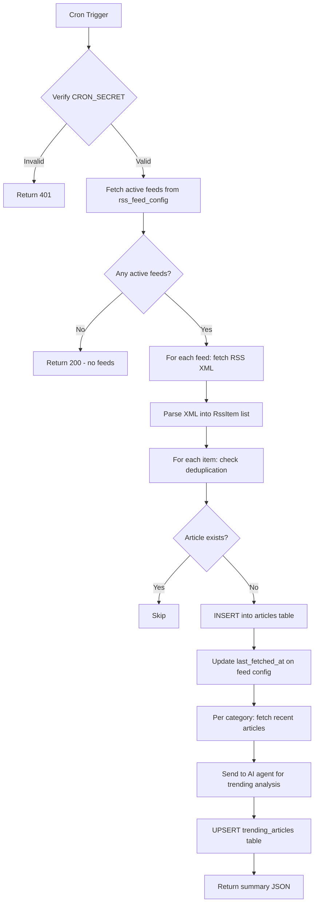
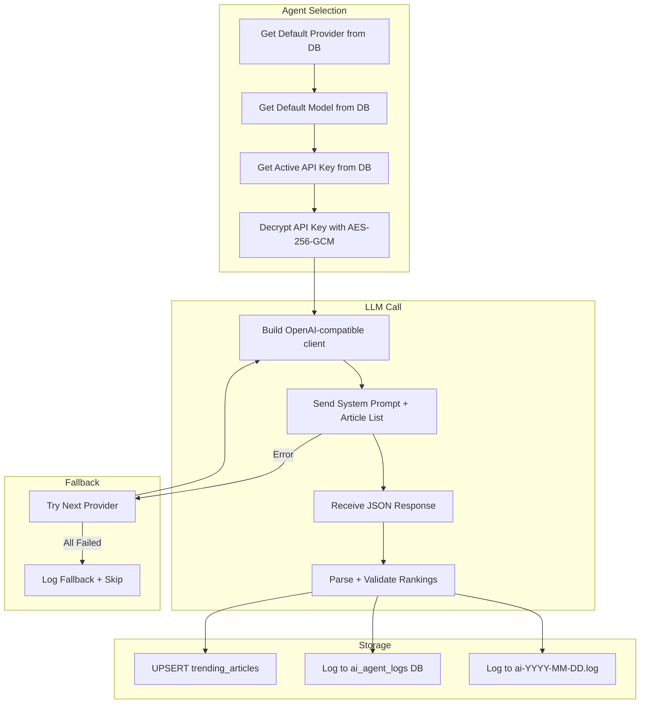
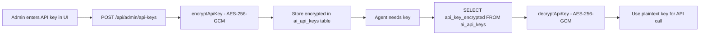

# Crons, APIs & Agents — Belgaum Today

---

## 1. Cron Jobs

### 1.1 RSS Feed Fetcher (`/api/cron/fetch-rss`)

**Endpoint:** `GET /api/cron/fetch-rss?secret=<CRON_SECRET>`

**Schedule:** Every 2 hours (configurable via `RSS_FETCH_INTERVAL_MINUTES`)

**Authentication:** Query parameter `secret` must match `CRON_SECRET` environment variable

**Execution Flow:**



**Step-by-step logging (all to `cron-*.log`):**

| Step | Log Message |
|---|---|
| Start | `▶ Cron started: fetch-rss` |
| Feed count | `├ fetch-rss: Found N active feeds` |
| Per feed | `├ fetch-rss: [category] source: N new, M skipped` |
| Trending | `├ fetch-rss: Trending updated for [category]` |
| Complete | `✓ Cron completed: fetch-rss (Xms)` with `{ feedsProcessed, newArticles, skipped }` |
| Error | `✕ Cron failed: fetch-rss` with stack trace |

**Response format:**

```json
{
    "message": "RSS fetch completed",
    "feedsProcessed": 34,
    "newArticles": 12,
    "skipped": 180,
    "trending": { "india": 5, "business": 5, "technology": 5 },
    "durationMs": 8432
}
```

### 1.2 Manual Cron Trigger (`/api/admin/cron`)

**Endpoint:** `POST /api/admin/cron`

**Authentication:** Admin JWT cookie required

**Purpose:** Allows admins to manually trigger the RSS fetch from the admin panel without waiting for the scheduled interval.

**Implementation:** Internally calls the `fetch-rss` endpoint with the CRON_SECRET.

---

## 2. API Routes (20 Total)

### 2.1 Public APIs

#### `GET /api/articles`

**Purpose:** List published articles with pagination and filtering.

| Parameter | Type | Default | Description |
|---|---|---|---|
| `page` | query | 1 | Page number |
| `limit` | query | 20 | Items per page |
| `category` | query | — | Filter by category |
| `status` | query | published | Article status filter |
| `featured` | query | — | Featured articles only |

**Response:** `{ success, data: { items: Article[], total, page, limit, totalPages } }`

#### `POST /api/articles`

**Purpose:** Create a new article (admin/editor only).

**Body:** `{ title, excerpt, content, category, source_name, source_url, featured_image, status }`

**Auto-generated:** `slug` (from title), `reading_time` (from content length)

---

#### `GET /api/articles/[id]`

**Purpose:** Fetch single article by ID.

#### `PUT /api/articles/[id]`

**Purpose:** Update article fields (admin/editor). Supports partial updates — only specified fields are changed.

#### `DELETE /api/articles/[id]`

**Purpose:** Delete article (admin only).

---

#### `GET /api/articles/slug/[slug]`

**Purpose:** Fetch published article by URL slug. Used by the public article detail page.

---

#### `GET /api/articles/featured`

**Purpose:** Fetch featured articles for the homepage hero section.

---

#### `GET /api/search`

**Purpose:** Full-text search across articles.

| Parameter | Type | Description |
|---|---|---|
| `q` | query | Search query (FULLTEXT) |
| `category` | query | Optional category filter |
| `startDate` | query | Date range start |
| `endDate` | query | Date range end |
| `sortBy` | query | `newest` \| `views` \| `relevant` |
| `limit` | query | Max results (default 20) |

**Implementation:** Uses MySQL `MATCH ... AGAINST` with `NATURAL LANGUAGE MODE`.

---

#### `GET /api/trending-topics`

**Purpose:** Fetch AI-ranked trending articles for sidebar and carousel.

**Response:** Array of trending articles with rank, score, and reasoning, joined with article data.

---

#### `POST /api/track/view`

**Purpose:** Record an article page view.

**Body:** `{ articleId, category, pageView }`

**Stores:** article_id, user_agent, IP address in `article_views` table. Increments `view_count` on the article.

---

#### `POST /api/track/source`

**Purpose:** Record when a user clicks the "Read Original" source link.

**Body:** `{ sourceName, articleId }`

**Stores:** source_name, article_id in `source_clicks` table.

---

### 2.2 Auth APIs

#### `POST /api/auth/login`

**Purpose:** Authenticate admin user.

**Body:** `{ email, password }`

**Process:**

1. Find user by email
2. bcrypt.compare password with stored hash
3. Generate JWT token (24h expiry)
4. Set httpOnly secure cookie (`auth_token`)

**Response:** `{ success, data: { user: { id, email, name, role } } }`

---

#### `POST /api/auth/logout`

**Purpose:** Clear authentication cookie.

**Process:** Delete `auth_token` cookie.

---

### 2.3 Admin APIs

All admin APIs require JWT authentication via httpOnly cookie.

#### `GET /api/admin/stats`

**Purpose:** Dashboard statistics.

**Returns:**

```json
{
    "totalArticles": 1234,
    "draftCount": 56,
    "publishedToday": 12,
    "totalViews": 45678,
    "topArticles": [{ "id": 1, "title": "...", "view_count": 500 }],
    "articlesPerDay": [{ "date": "2026-02-15", "count": 12 }],
    "categoryStats": [{ "category": "india", "count": 300 }],
    "sourceStats": [{ "source": "Hindustan Times", "count": 600 }]
}
```

---

#### `GET /api/admin/articles`

**Purpose:** Paginated article list for admin (includes drafts).

#### `PATCH /api/admin/articles`

**Purpose:** Bulk update article status.

#### `DELETE /api/admin/articles`

**Purpose:** Delete article by ID.

---

#### `GET /api/admin/feeds`

**Purpose:** List all RSS feed configurations.

#### `PATCH /api/admin/feeds`

**Purpose:** Update feed (toggle active, change URL, etc.).

---

#### `GET /api/admin/logs`

**Purpose:** Query system logs with filters (level, category, date range).

---

#### `GET /api/admin/agent-logs`

**Purpose:** Query AI agent call logs with filters (provider, status, category, date range).

---

#### `GET/POST/PATCH/DELETE /api/admin/providers`

**Purpose:** CRUD operations for AI providers.

---

#### `GET/POST/PATCH/DELETE /api/admin/models`

**Purpose:** CRUD operations for AI models.

---

#### `GET/POST/PATCH/DELETE /api/admin/api-keys`

**Purpose:** CRUD operations for encrypted API keys.

**Note:** API keys are encrypted using AES-256-GCM before storage. On GET, keys are returned masked (first 4 + last 4 chars visible).

---

### 2.4 API Logging

All 20 API routes are wrapped with `withLogging()` HOC:

```typescript
export const GET = withLogging(async (request: NextRequest) => {
    // handler logic
});
```

**What gets logged per request:**

| Field | Source |
|---|---|
| Method | `request.method` |
| Path | `url.pathname` |
| Query params | `url.searchParams` |
| IP address | `x-forwarded-for` or `x-real-ip` header |
| User-Agent | `user-agent` header (first 100 chars) |
| Content-Type | `content-type` header |
| Response status | `response.status` |
| Duration (ms) | `Date.now() - startTime` |
| Errors | Full error message + stack trace (first 5 lines) |

---

## 3. AI Agent System

### 3.1 Architecture



### 3.2 Supported Providers

| Provider | SDK Format | Base URL | Default Model |
|---|---|---|---|
| **OpenAI** | `openai` | `https://api.openai.com/v1` | gpt-4o-mini |
| **Anthropic** | `anthropic` | `https://api.anthropic.com` | claude-3.5-sonnet |
| **DeepSeek** | `openai` | `https://api.deepseek.com/v1` | deepseek-chat |
| **Google Gemini** | `gemini` | `https://generativelanguage.googleapis.com` | gemini-2.0-flash |
| **SarvamAI** | `openai` | `https://api.sarvam.ai/v1` | sarvam-m |

### 3.3 Prompts

**System Prompt — The AI acts as a senior news editor:**

> You are a senior news editor AI specializing in `{category}` news for an Indian audience.
> Select the top `{count}` most trending and newsworthy stories.

**Ranking Criteria (in order):**

1. Breaking significance
2. National/regional impact
3. Reader interest
4. Uniqueness
5. Source credibility

**Response Format:**

```json
[
    {
        "articleId": 123,
        "rank": 1,
        "score": 95,
        "reasoning": "Breaking story affecting millions nationwide"
    }
]
```

**User Prompt:**
Lists up to 50 recent articles with format:

```
[ID:123] "Article Title" — Excerpt... (Source: Hindustan Times, Published: 2026-02-15)
```

### 3.4 Agent Logging

Every AI call logs to **both** `ai_agent_logs` DB table and `ai-YYYY-MM-DD.log` file:

| Field | Description |
|---|---|
| `provider` | Provider name (e.g., "openai") |
| `model` | Model ID (e.g., "gpt-4o-mini") |
| `category` | News category analyzed |
| `status` | success / error / fallback |
| `input_articles` | Number of articles sent |
| `output_trending` | Number of rankings returned |
| `prompt_tokens` | Token usage |
| `duration_ms` | API call duration |
| `error_message` | Error details (if any) |
| `request_summary` | Prompt summary |
| `response_summary` | Response summary |

### 3.5 API Key Security



**Encryption details:**

- Algorithm: AES-256-GCM
- Key derivation: `scrypt(JWT_SECRET, 'belgaum-today-salt', 32)`
- IV: 12 random bytes per encryption
- Auth tag: 16 bytes
- Storage: Base64 encoded `iv + authTag + ciphertext`
- Display: Masked as `sk-p****3sA` (first 4 + last 4 chars)
